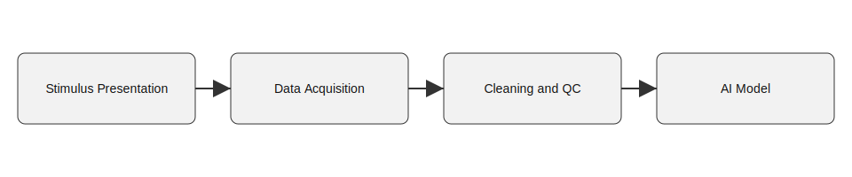

# MVNA-ASD

MVNA-ASD is a multimodal visual-cognition dataset for early childhood ASD.

## Workflow


## Quick Start
```bash
pip install -r requirements.txt
python src/preprocessing/01_bids_conversion.py --input data/sourcata --output data/raw_bids
```

## Citation
```bibtex
@article{mvna_asd_2024,
  title = {MVNA-ASD: Multimodal Visual-Neural Alignment Benchmark for Pediatric ASD},
  author = {Author, First and Author, Second},
  journal = {Journal Name},
  year = {2024}
}
```

## Critical hardware sync
This project uses a photodiode for hardware triggering.
Run src/preprocessing/02_resync_photodiode.py before any analysis.
The script reads TRIG and PHOTO channels, computes the offset, and corrects all event onsets.
Skipping this step introduces about 30 ms latency error in N170 peak timing.

## Data privacy
All data under data/ are de-identified.
The subject ID to hospital record mapping is not in this repository.
Contact the PI for the encrypted physical drive that contains the mapping table.
